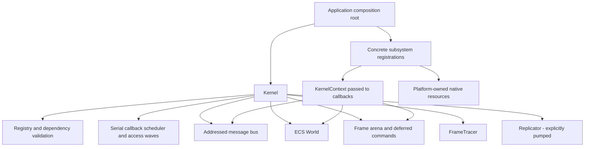

# Kernel Architecture

## 1. Design goal

### Current ownership map

This is ownership and access, not parallel execution. The main binary wires drivers in `src/main.rs`. Native examples have their own composition loops; they must be inspected separately before assuming that every native input/render operation is scheduled by `Kernel::run_until`.

The target architecture is a typed, data-oriented runtime with explicit ownership
boundaries:

- Rust's compiler specializes typed system and component code.
- The runtime resolves dynamic values, entity membership, change ticks, visibility,
  scheduling state, and platform capabilities.
- The renderer consumes an extracted read-only render world rather than borrowing the
  simulation world while GPU work is prepared.
- The GPU performs bounded culling, binning, sorting, and indirect draw generation where
  that workload is profitable.
- Every untrusted or runtime-sized operation has a bound, fallible result, or explicit
  backpressure policy.

This is not a replacement of the ECS with a string/value registry. Runtime values are
indices and metadata alongside typed ECS storage, not substitutes for typed components.

## 2. Current repository boundaries

The current composition root registers kernel subsystems for window, input, renderer,
physics, audio, and scripting. The kernel currently owns:

- subsystem registration and dependency validation;
- deterministic dependency ordering and dependency waves;
- access-aware schedule planning with exclusive compatibility defaults;
- bounded parallel job execution primitives;
- the message bus and KernelContext;
- ECS entities, generations, sparse component storage, bitsets, and queries;
- frame arenas, pools, ring buffers, synchronization, replication, WAL, and tracing.

The renderer currently models device/queue/frame/swapchain synchronization and can use an
externally supplied native lane. It now also owns a bounded frame-owned RenderWorld
extraction boundary, while the default composition remains headless. Native Vulkan
bootstrap is optional and incomplete across platforms.

## 3. Target layers

~~~text
Application systems
  typed gameplay, UI, physics, audio, scripting, asset and network policies
        |
Kernel orchestration
  schedule graph, access metadata, dependency sets, deferred command boundaries
        |
ECS and runtime indices
  typed component storage, change ticks, archetype/chunk metadata, value side indices
        |
Extraction boundary
  immutable render snapshot, visibility filters, stable instance IDs, frame ownership
        |
Render world
  GPU instance data, material/mesh tables, culling inputs, indirect command buffers
        |
Renderer backend
  Vulkan device, surface, swapchain, command pools, barriers, queue submission
        |
Platform abstraction
  Linux X11/Wayland policy, Windows Win32 policy, io_uring, IOCP, clocks and waits
~~~

## 4. Non-negotiable invariants

1. Simulation systems cannot mutate the render world directly.
2. GPU buffers are never indexed without a checked capacity contract.
3. A device-loss, swapchain-out-of-date, or allocation failure is an explicit state, not
   an unchecked panic.
4. The schedule graph is validated before execution; missing dependencies and cycles fail
   deterministically.
5. Deferred structural changes apply only at declared mutation boundaries.
6. Runtime values are bounded by count, byte, and lifetime budgets.
7. Network replication never trusts client-owned authoritative state.
8. Native platform code is isolated behind cfg gates and safe public contracts.
9. The headless path remains buildable and testable without a display or GPU.
10. Performance changes require a benchmark baseline and a correctness regression test.

## 5. Frame data flow

~~~text
Simulation world
  -> schedule graph executes systems
  -> deferred commands are committed
  -> extract immutable render data
  -> prepare GPU buffers and descriptors
  -> GPU culling/binning/sorting
  -> indirect command generation
  -> Vulkan command recording
  -> queue submit with semaphores/fences
  -> present or headless completion
~~~

The extraction boundary is the ownership boundary. It prevents a renderer from holding
long-lived mutable ECS borrows and makes it possible to overlap next-frame simulation
with current-frame render preparation.

Structural ECS mutations use the same boundary discipline: subsystem code queues bounded
spawn/despawn commands through KernelContext, and the kernel applies them after the frame
systems finish. A full typed command payload system remains a later extension.

## 6. What this architecture is not

- It is not “put every component in a Box and render it”.
- It is not a guarantee that GPU batching always wins; small workloads may use CPU
  sorting and direct draws.
- It is not a promise that WSL can validate native Linux window presentation. WSL can run
  Linux/headless and software/virtualized paths, while native Linux presentation needs a
  Linux host with the required display and Vulkan driver.
- It is not a promise of zero allocations. It is a policy that hot paths are bounded,
  measurable, and fallible.
