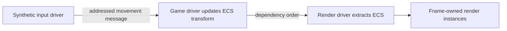

# Input to headless rendering

This executable tutorial connects three kernel drivers: a deterministic input producer, a game that updates ECS, and a render preparation consumer. It uses synthetic input so it works without a native window. It prepares a render snapshot; it does not submit GPU work.

## Data and execution order



The game depends on input, which also authorizes the input-to-game message route. Render depends on game and sees its immediate component update in the same frame. Structural deferred commands would instead commit after all three callbacks.

## Complete application

Save as `examples/docs_pipeline.rs` in your checkout, then run `cargo run --example docs_pipeline`. Mesh/material IDs below are packet metadata, not allocated GPU resources.

```rust
use rust_kernel_game_engine_kit::kernel::{
    GamePlugin, GamePluginHost, Kernel, KernelContext,
};
use rust_kernel_game_engine_kit::subsystems::renderer::{
    RenderTransform, RenderMaterial, RenderWorld,
};

struct Input;
impl GamePlugin for Input {
    fn name(&self) -> &'static str { "demo_input" }
    fn dependencies(&self) -> &'static [&'static str] { &[] }
    fn tick(&mut self, ctx: &mut KernelContext<'_>, _: u64) {
        let target = ctx.resolve("demo_game").unwrap();
        ctx.publish(target, 1, 1.0_f32).unwrap();
    }
}

struct Game;
impl GamePlugin for Game {
    fn name(&self) -> &'static str { "demo_game" }
    fn dependencies(&self) -> &'static [&'static str] { &["demo_input"] }
    fn init(&mut self, ctx: &mut KernelContext<'_>) {
        let world = ctx.world_write();
        let entity = world.spawn();
        world.insert(entity, RenderTransform {
            matrix: [1.,0.,0.,0., 0.,1.,0.,0., 0.,0.,1.,0.],
            bounds: [0.,0.,0.,1.],
        });
        world.insert(entity, RenderMaterial { mesh_id: 0, material_id: 0 });
    }
    fn tick(&mut self, ctx: &mut KernelContext<'_>, _: u64) {
        let mut movement = 0.0;
        for message in ctx.receive() {
            if message.topic == 1 {
                if let Ok(value) = message.downcast::<f32>() { movement += *value; }
            }
        }
        let mut target = None;
        ctx.world_read().for_each_entity(|entity| target = Some(entity));
        if let Some(entity) = target {
            let transform = ctx.world_write().get_mut::<RenderTransform>(entity).unwrap();
            transform.matrix[3] += movement;
            transform.bounds[0] += movement;
        }
    }
}

struct Render { snapshot: RenderWorld }
impl GamePlugin for Render {
    fn name(&self) -> &'static str { "demo_render" }
    fn dependencies(&self) -> &'static [&'static str] { &["demo_game"] }
    fn tick(&mut self, ctx: &mut KernelContext<'_>, _: u64) {
        self.snapshot.extract_typed(ctx.world_read()).unwrap();
        assert_eq!(self.snapshot.instances().len(), 1);
        println!("x={}", self.snapshot.instances()[0].transform[3]);
    }
}

fn main() -> Result<(), Box<dyn std::error::Error>> {
    let mut kernel = Kernel::new();
    kernel.register(Box::new(GamePluginHost::new(Input)))?;
    kernel.register(Box::new(GamePluginHost::new(Game)))?;
    kernel.register(Box::new(GamePluginHost::new(Render {
        snapshot: RenderWorld::with_capacity(4),
    })))?;
    kernel.init()?;
    kernel.run(3)?;
    kernel.shutdown();
    Ok(())
}
```

Expected output includes `x=1`, `x=2`, and `x=3`. The example assumes exactly one entity and uses `unwrap` for its fixed-capacity demonstration. Production code must propagate capacity failures and select entities explicitly. Replace the synthetic input producer with a platform input adapter when building an interactive application; keep the game state boundary unchanged.
