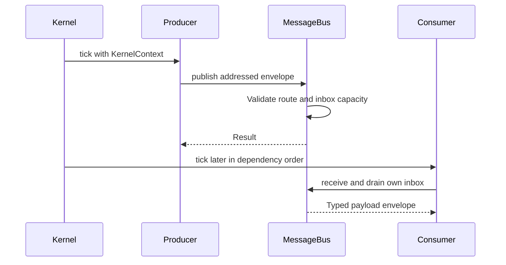

# Send and receive messages

## An addressed message

The bus routes envelopes to subscriber inboxes. The sender, destination and topic are routing metadata; the payload retains its Rust type.

```rust
use rust_kernel_game_engine_kit::kernel::bus::MessageBus;

let mut bus = MessageBus::new();
let sender = bus.add_subscriber();
let receiver = bus.add_subscriber();
bus.set_debug_edges(&[vec![], vec![0]]);
let envelope = bus.envelope(sender, receiver, 7, Box::new(42_u64));
bus.publish(envelope).expect("valid route with available capacity");
assert!(bus.pop_inbox(receiver).is_some());
assert!(bus.pop_inbox(receiver).is_none());
```

The example demonstrates one delivery and an empty inbox afterward. It does not imply network transport or broadcast semantics.

## Sending from a driver

```rust
use rust_kernel_game_engine_kit::kernel::KernelContext;

fn send_score(ctx: &mut KernelContext<'_>, score: u64) {
    if let Some(destination) = ctx.resolve("score_display") {
        if let Err(error) = ctx.publish(destination, 7, score) {
            eprintln!("score message rejected: {error:?}");
        }
    }
}
```

Register the destination driver and agree on topic/payload semantics. The receiver must declare the sender in its dependencies: debug builds check this routing edge and panic on undeclared sends. Kernel initialization installs the edges; the standalone example configures them explicitly. Decide whether a full queue means retry, drop, or fatal failure for your application.

## Ordering and borrowing



The diagram assumes the consumer declares the producer as a dependency. Immediate delivery and callback order together allow same-frame consumption in this direction.

Addressed publication is immediate. Whether the receiving driver processes it this frame depends on callback order. `ctx.receive()` borrows the bus: finish draining before calling another method that needs a mutable context. Store only the bounded information you need for the next phase.

## Tests to read

`tests/kernel_bus.rs` covers the bus boundary. `tests/subsystem_bus_integration.rs` exercises routed subsystem behavior. `benches/kernel.rs` measures a publish-and-pop round trip; that measurement includes envelope/payload work and is not a network latency result.
