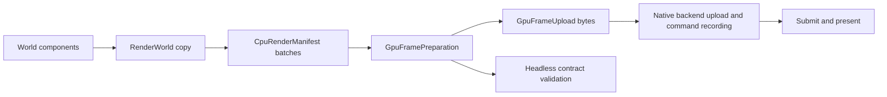

# Rendering and platform support

## Frame ownership



The native branch needs a device, surface and valid resources supplied by the platform composition. CPU packet preparation remains independently testable.

The renderer extracts typed ECS transforms and materials into a bounded `RenderWorld`. `CpuRenderManifest` sorts/batches instances. `GpuFramePreparation` validates command ranges, and `GpuFrameUpload` encodes instance records and Vulkan indexed-indirect command bytes.

These CPU preparation stages can be validated without a GPU. A successful upload encoding test proves the packet contract, not that a native device displayed the frame.

## Resource tables

### Extract a simulation entity and prepare a batch

```rust
use rust_kernel_game_engine_kit::kernel::World;
use rust_kernel_game_engine_kit::subsystems::renderer::{
    RenderTransform, RenderMaterial, RenderWorld,
    CpuRenderManifest, GpuFramePreparation,
};

let mut world = World::new();
let entity = world.spawn();
world.insert(entity, RenderTransform {
    matrix: [1., 0., 0., 0., 0., 1., 0., 0., 0., 0., 1., 0.],
    bounds: [0., 0., 0., 1.],
});
world.insert(entity, RenderMaterial { mesh_id: 0, material_id: 0 });
let mut extracted = RenderWorld::with_capacity(16);
assert_eq!(extracted.extract_typed(&world).unwrap().extracted, 1);
let mut manifest = CpuRenderManifest::with_capacity(16, 4);
manifest.build(&extracted).unwrap();
let mut prepared = GpuFramePreparation::with_capacity(16, 4);
prepared.prepare(&manifest).unwrap();
assert_eq!(prepared.instances().len(), 1);
```

The 12 floats encode the engine's affine transform representation. This example validates extraction and preparation only. Mesh/material ID zero must correspond to real resources before native submission. Adding these components does not create a mesh or window automatically.

`renderer_3d.rs` defines generational mesh/material handles and bounded tables. Mesh insertion validates supplied bytes, stride, indices, and bounds. Removing a resource invalidates its old generation. Render views and world-pass configuration have explicit validation paths.

## Backend boundaries

`RenderBackend` allows headless submission. Native platform implementations own device and presentation details. Keep platform handles out of gameplay state. Treat surface recreation, out-of-date swapchains, synchronization, and allocation failure as explicit lifecycle cases.

## Example-specific paths

Sudoku uses a GDI presentation bridge on Windows by default. Its experimental Vulkan opt-in is distinct from the main binary's native switch. Rubik uses the Windows Vulkan demonstration path and a bounded frame lifetime.

The Rubik scene currently validates mesh-table resources while its bring-up shader expands cube geometry from the vertex index. Do not use this example as evidence that every arbitrary mesh rendering path is complete.

## GPU validation

Dedicated hardware GPU CI is disabled until a GPU server is provisioned. Shader compilation and software Vulkan enumeration remain useful contract checks. They do not establish native hardware throughput or an 18-million-object GPU milestone.

See [3D design](3d.md), [Vulkan design](vulkan.md), and [GPU-driven design](gpu.md) for the remaining integration work.
