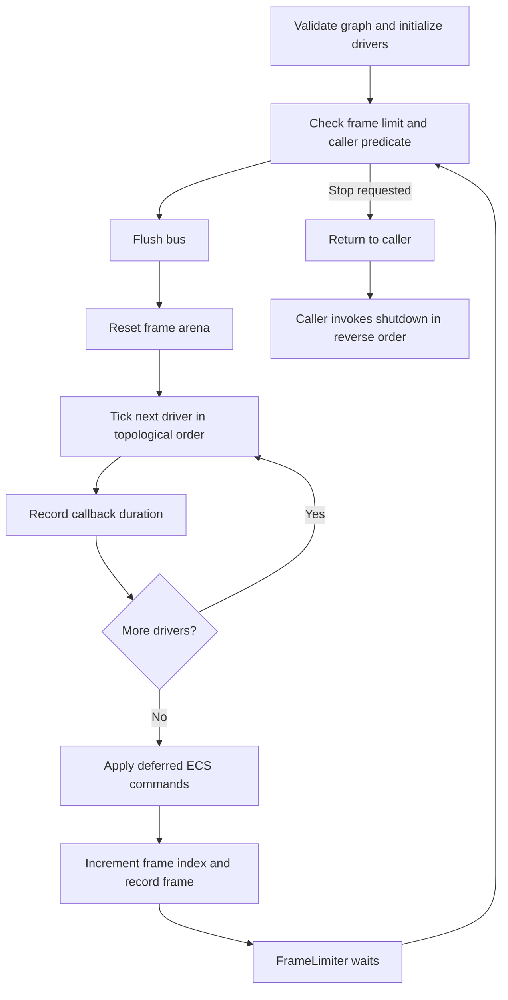

# Kernel and frame lifecycle

## Composition root

`src/main.rs` creates the clock, constructs concrete drivers, registers them with `Kernel`, calls `init`, runs frames, and calls `shutdown`. Drivers implement `Subsystem` with a unique name, dependency names, initialization, tick, and teardown callbacks.

## Initialization

The registry resolves dependency names. Missing dependencies and cycles are startup errors. The scheduler builds a topological order and access-aware waves, allocates subscriber inboxes, resets scratch storage, and initializes drivers in dependency order.

`SystemAccess` declares logical read/write resource names. The compatibility default is exclusive. Read/write declarations inform planning; they do not make sharing mutable kernel contexts across threads safe.

## Frame execution

Extraction performed inside a renderer callback happens before the end-of-frame deferred commit. A deferred spawn therefore does not automatically appear in that same callback's render snapshot. The kernel does not insert a separate extraction stage after the commit.

The fixed simulation delta is `16_666_667` nanoseconds. `Kernel::run_until` checks its caller predicate, flushes the bus, rewinds the frame arena, executes callbacks in order, and commits deferred structural work at the frame boundary. Frame pacing uses `FrameLimiter` at 60 Hz.

The production callback loop is serial. `ParallelWaveExecutor` is a separate bounded job primitive; the presence of planned waves does not imply parallel execution of all `Subsystem::tick` callbacks.

## KernelContext

Drivers receive a context rather than direct references to other drivers. It exposes the caller's subscriber ID, name resolution, ECS access, frame scratch, deferred spawn/despawn, and typed addressed messages.

`publish` can fail for a full inbox or unknown recipient. Addressed messages are delivered immediately. Drain received messages before publishing if an inbox iterator still borrows the bus. Avoid assuming every message waits until the next frame.

## Memory and timing discipline

The default scratch arena is 1 MiB and the default deferred command capacity is 4096. Do not retain scratch references across frames. The subsystem trait states an allocation-free deterministic tick policy; boxed message payloads and other implementation paths still need measurement before claiming every tick is allocation-free.

## Shutdown

Drivers shut down in reverse dependency order. Keep native resources alive for the period during which dependent rendering operations can use them.

Sources: [scheduler.rs](https://github.com/j4flmao/rust-kernel-game-engine-kit/blob/main/src/kernel/scheduler.rs), [context.rs](https://github.com/j4flmao/rust-kernel-game-engine-kit/blob/main/src/kernel/context.rs), [subsystem.rs](https://github.com/j4flmao/rust-kernel-game-engine-kit/blob/main/src/kernel/subsystem.rs).
